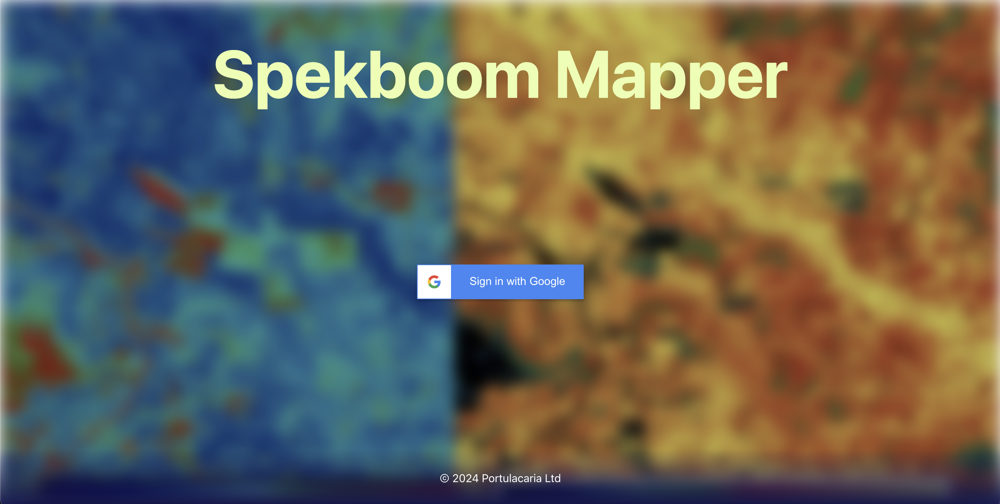
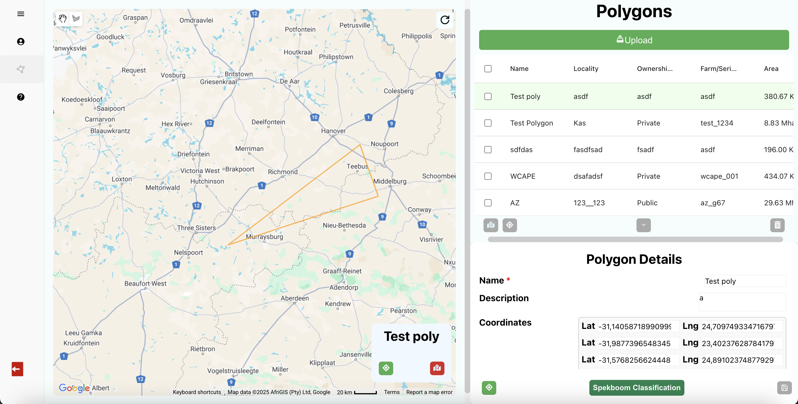
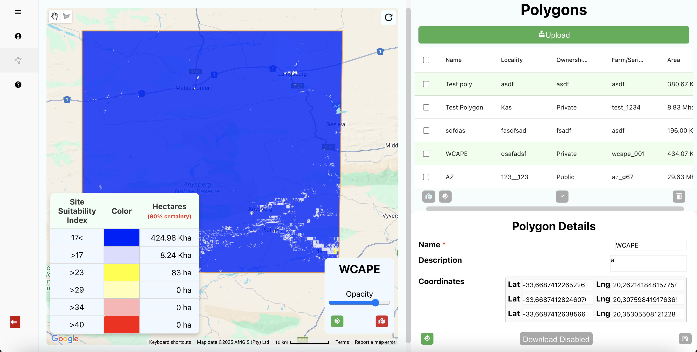

# Spekboom Mapper

## Overview
Spekboom Mapper is a full-stack web application built for **AGL Eye Corporation** clients. 
It is designed to facilitate the management and classification of geographical regions using an intuitive and interactive map. The application enables the user to draw, store and analyze polygons, leveraging Google Earth Engine for performing advanced Portulacaria classifications, displaying potential growth abundance.

## Features
- Google OAuth 2.0 authentication for secure access
- Interactive map for drawing and managing polygons with the **Google Maps API**
- Polygon Spekboom classification through the **Google Earth Engine API**
- **PostgreSQL** database for storing user info and polygon details
 
## Tech Stack
- **Frontend**: React with Typescript
- **Backend**: Node.js (Express.js)
- **Database**: PostgreSQL
- **Containerization**: Docker
- **CI/CD**: GitHub Actions

## Images

